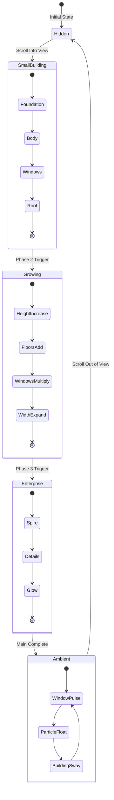

# Building Growth Animation - Design Specification

## Overview

This animation visually represents Good Shepherd Insights' core value proposition: **growing small businesses into large enterprises**. The animation shows a small business building that transforms and scales upward into a modern enterprise tower.

## Brand Context

- **Company**: Good Shepherd Insights, LLC.
- **Tagline**: Business Development Agency
- **Primary Brand Color**: `#99FF33` (Lime Green)
- **Secondary Colors**: 
  - Dark backgrounds with subtle grays
  - White/cream text (`#FFF3E8`)
  - Supporting gray tones

## Animation Concept

### Visual Narrative

```
Phase 1: Small Business Building (Initial State)
├── Simple 2-3 story building
├── Small windows illuminated
├── Single door entrance
├── Minimal details

Phase 2: Growth Transformation
├── Building stretches upward
├── Additional floors materialize
├── Windows multiply and expand
├── Foundation strengthens

Phase 3: Enterprise Tower (Final State)
├── Modern multi-story tower
├── Glass facade with many windows
├── Corporate entrance
├── Building details like antenna/spire
├── Ambient glow effects
```

## SVG Structure

### Small Business Building Elements

```
┌─────────────────────────────────────┐
│              ▔▔▔▔▔▔▔▔               │  ← Roof (simple pitched)
│           │   🔲   🔲   │            │  ← Upper floor windows (2)
│           │   🔲   🔲   │            │  ← Middle floor windows (2)
│           │   🔲   🚪   │            │  ← Ground floor (window + door)
│           └───────────┘            │  ← Foundation
└─────────────────────────────────────┘
```

### Enterprise Building Elements

```
┌─────────────────────────────────────┐
│                ▲                    │  ← Spire/Antenna
│            ╔═══════╗                │  ← Modern flat roof with details
│            ║🔲🔲🔲🔲║                │  ← Top floor (4 windows)
│            ║🔲🔲🔲🔲║                │  ← Floor 5
│            ║🔲🔲🔲🔲║                │  ← Floor 4
│           ╔╩══════╩╗                │  ← Building widens
│           ║🔲🔲🔲🔲🔲║               │  ← Floor 3
│           ║🔲🔲🔲🔲🔲║               │  ← Floor 2
│           ║🔲 🚪🚪 🔲║               │  ← Ground floor (grand entrance)
│           ╚═════════╝               │  ← Strong foundation
│        ═══════════════             │  ← Ground line with glow
└─────────────────────────────────────┘
```

## Animation Phases & Timeline

### Phase 1: Initial Appearance (0ms - 800ms)
**Small building fades in and establishes base**

| Element | Animation | Duration | Easing |
|---------|-----------|----------|--------|
| Foundation | Scale Y from 0 to 1, fade in | 400ms | outExpo |
| Building body | Scale Y from bottom | 500ms | outBack |
| Door | Fade in, scale from center | 300ms | outElastic |
| Windows | Stagger fade in | 200ms each | outQuad |
| Roof | Drop in from above | 400ms | outBounce |

### Phase 2: Growth Transformation (800ms - 2500ms)
**Building stretches and transforms**

| Element | Animation | Duration | Easing |
|---------|-----------|----------|--------|
| Building body | Height increases (3x) | 1200ms | inOutQuad |
| New floors | Stagger appearance upward | 150ms each | outBack |
| Windows | Multiply and spread | 100ms per window | outQuad |
| Building width | Gradual expansion | 800ms | inOutSine |
| Foundation | Strengthens/widens | 600ms | outQuad |

### Phase 3: Enterprise Finalization (2500ms - 3500ms)
**Final details and polish**

| Element | Animation | Duration | Easing |
|---------|-----------|----------|--------|
| Spire/antenna | Grows from top | 500ms | outElastic |
| Roof details | Fade in | 300ms | outQuad |
| Entrance upgrade | Transform animation | 400ms | outBack |
| Ambient glow | Pulse begins | 600ms | inOutSine |
| Success particles | Burst effect | 400ms | outExpo |

### Phase 4: Continuous Animations (Loop)
**Ambient effects that continue after main sequence**

| Effect | Animation | Duration | Loop |
|--------|-----------|----------|------|
| Window glow pulse | Opacity 0.7→1→0.7 | 3000ms | ∞ |
| Building subtle sway | Rotate ±0.5deg | 6000ms | ∞ |
| Floating particles | Y movement, opacity | 4000-6000ms | ∞ |
| Spire beacon | Glow pulse | 2000ms | ∞ |
| Ground glow | Expand/contract | 4000ms | ∞ |

## Color Scheme

### Building Colors

```css
/* Primary Structure */
--building-primary: #2A2A2A;      /* Dark gray facade */
--building-secondary: #3D3D3D;    /* Lighter gray accent */
--building-outline: #404040;      /* Subtle outline */

/* Windows */
--window-fill: #99FF33;           /* Brand green */
--window-glow: rgba(153, 255, 51, 0.6);
--window-dark: #1A1A1A;           /* Unlit windows */

/* Accents */
--accent-glow: rgba(153, 255, 51, 0.3);
--ground-line: #99FF33;
--particle-color: #CCFF99;

/* Foundation */
--foundation-color: #222222;
--foundation-highlight: #333333;
```

## SVG ViewBox & Dimensions

```
ViewBox: 0 0 200 120
Aspect Ratio: 5:3 (wide format)
Max Container Width: 400px
Responsive breakpoints: 320px, 280px
```

## Component Architecture

```tsx
BuildingGrowthAnimation/
├── BuildingGrowthAnimation.tsx    // Main component
├── BuildingGrowthAnimation.css    // Styles
└── types.ts                       // TypeScript interfaces (if needed)
```

### Component Props

```typescript
interface BuildingGrowthAnimationProps {
  autoPlay?: boolean;        // Start animation on mount
  scrollTrigger?: boolean;   // Trigger on scroll into view
  loop?: boolean;            // Loop the main transformation
  speed?: number;            // Animation speed multiplier
}
```

## Accessibility Considerations

1. **Reduced Motion**: Respect `prefers-reduced-motion: reduce`
   - Disable looping animations
   - Simplify transitions to opacity only
   - Skip complex transform sequences

2. **Screen Reader**: Add `aria-label` describing the animation concept

3. **Focus States**: No interactive elements, decorative only

## Performance Optimizations

1. **GPU Acceleration**:
   ```css
   transform: translateZ(0);
   will-change: transform, opacity;
   ```

2. **Animation Control**:
   - Pause animations when not in viewport
   - Use `requestAnimationFrame` for scroll handlers
   - Debounce/throttle scroll events

3. **SVG Optimization**:
   - Minimal path complexity
   - Reuse gradients and filters
   - Avoid excessive filter blur radii

## Mermaid Diagram - Animation Flow



## File Structure Changes

### New Files
- `src/blocks/Animations/BuildingGrowthAnimation/BuildingGrowthAnimation.tsx`
- `src/blocks/Animations/BuildingGrowthAnimation/BuildingGrowthAnimation.css`

### Modified Files
- `src/app/components/Projects.tsx` - Update import to use new animation

### Optional - Keep Legacy
The `IntegrationAnimation` component can be kept for reference or removed after verification.

## Success Criteria

1. ✅ Animation tells the story of business growth
2. ✅ Uses brand colors consistently (#99FF33)
3. ✅ Smooth 60fps performance
4. ✅ Works on mobile devices
5. ✅ Respects reduced motion preferences
6. ✅ Loops smoothly without jumps
7. ✅ Scroll-triggered entrance
8. ✅ Professional, production-ready appearance